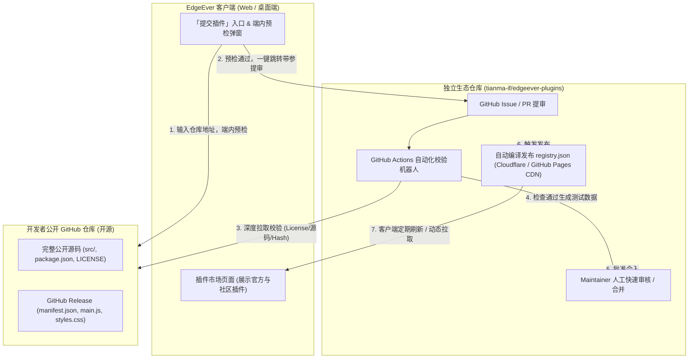

# EdgeEver 社区插件市场方案设计

本文档阐述 EdgeEver 社区插件市场的整体架构、开源合规门禁、端内提交入口以及中心化动态分发机制。

---

## 一、 背景与设计目标

EdgeEver 当前已具备受信任的客户端插件与无代码主题运行时（基于 `@edgeever/plugin-api`），并支持从 GitHub 仓库或 Manifest 地址直接安装。然而，当前官方插件市场存在以下局限：

1. **发布通道与主工程强耦合**：市场索引（`registry.json`）静态打包于 Web 前端，新增插件需要跟随主工程发布发版。
2. **缺乏标准化的社区提交入口**：社区开发者无法通过便捷管道提交自己的插件作品。
3. **缺乏自动化的开源合规审查**：平台要求收录的插件“必须全部开源”，但目前缺乏机械可执行的门禁工具来保障代码公开性、开源许可证合规性与源码透明度。

### 核心目标
- **繁荣插件生态**：降低社区开发者的开发、调试与上架门槛。
- **端内提交入口**：在 EdgeEver 客户端内提供直观的提交与预检向导。
- **强制开源保障**：建立零信任、全自动化的开源合规门禁（OSI 许可证、人类可读源码、不可变构建追溯）。
- **解耦独立分发**：建立独立的插件元数据仓库，支持自动化 CI 审核合流与 CDN 动态分发。

---

## 二、 总体架构设计

采用**方式 A：独立专用仓库（`tianma-if/edgeever-plugins`）+ 自动化 IssueOps / PR CI + CDN 动态分发**的架构模式。



### 独立仓库目录规范
为了避免多开发者同时提审导致的 Git 合并冲突，采用“单插件单文件声明，CI 自动聚合”的设计：

```text
tianma-if/edgeever-plugins
├── .github/
│   ├── ISSUE_TEMPLATE/
│   │   ├── new-plugin.yml            # 插件上架申请表单
│   │   └── update-plugin.yml         # 插件版本更新申请
│   └── workflows/
│       ├── test-submission.yml       # PR / Issue 触发自动化开源与合规质检
│       └── build-registry.yml        # main 合入后聚合编译并发布 CDN
├── plugins/                          # 每个插件独立一份元数据文件
│   ├── org.edgeever.tasks.json
│   ├── org.edgeever.plugins.ai-rss.json
│   └── com.example.readwise.json
├── scripts/
│   ├── verify-plugin.mjs             # 开源合规与资产完整性质检脚本
│   └── compile-registry.mjs          # 将 plugins/*.json 聚合为 registry.json
├── schemas/
│   └── plugin-submission.schema.json # JSON Schema 校验规范
└── README.md                         # 社区开发者提审指南与政策
```

---

## 三、 “必须全部开源”的技术验证与门禁体系

任何进入社区插件市场的扩展必须通过以下五道全自动 CI 门禁，违规即阻断：

| 校验维度 | 验证规则与技术手段 | 未通过处理 |
| :--- | :--- | :--- |
| **1. 仓库可见性** | 必须为公共公开仓库（Public GitHub Repository）。通过 GitHub API 校验 `private === false`。 | 阻断提审 |
| **2. OSI 认可许可证** | 仓库根目录必须含有 `LICENSE` / `LICENSE.md` 文件。通过 GitHub License API 读取 `license.spdx_id`，必须匹配 OSI 认可的开源许可证（如 MIT、Apache-2.0、GPL-3.0、BSD-3-Clause、MPL-2.0 等）。严禁私有商业许可证或未附许可证。 | 阻断提审 |
| **3. 真实可读源码（防伪装开源）** | 检查仓库必须包含未混淆的源码目录（如 `src/` 或根目录源代码）以及构建描述文件（`package.json`、`tsconfig.json` 等）。严禁仅在仓库提交打包压缩后的 `main.js` 而无实际源码的“空壳开源”。 | 阻断提审 |
| **4. 资产不可变追溯** | Release Tag 必须对应确定的 Git Commit SHA。CI 自动下载 Release 资产（`manifest.json`、`main.js`、`styles.css`），计算 SHA-256 并固化在 Registry 中，确保用户安装与审核版本完全一致。 | 阻断提审 |
| **5. 静态安全与能力扫描** | 对 `main.js` 进行 AST 静态分析：<br>1. 严禁包含混淆的 `eval()` 或 `new Function()` 等动态代码执行；<br>2. 严禁在运行时动态引入外部未经审核的远程 JS 脚本；<br>3. 检查网络请求域名声明，若有远程网络外发须在详情中明确披露。 | 触发安全告警，人工介入排查 |

---

## 四、 提交入口与端内预检流程

在保证安全的前提下，提供极低门槛的提交体验：

### 1. 端内提交入口
- **位置**：在 EdgeEver 客户端「设置 -> 扩展与插件」面板右上角（与“开发文档”并排），新增 **「提交插件」** 按钮。
- **预检向导（In-app Wizard）**：
  1. 开发者在弹窗中粘贴其公开 GitHub 仓库地址。
  2. 客户端调用 EdgeEver 后端现有的 GitHub 代理 API 进行前置即时检测：
     - 是否存在且公开？
     - 是否包含有效 `manifest.json`（ID 命名空间、版本号、作者等）？
     - 是否检测到合法的开源许可证？
     - 是否已发布包含必须资产的 Release？
  3. **预检结果可视化反馈**：
     - 若有缺失（如“缺少 LICENSE 文件”或“Release 资产未上传 main.js”），即时提示错误与解决方案。
     - 若预检全部通过，生成 **「前往 GitHub 确认提交」** 按钮。
  4. **一键直达提审**：
     - 点击按钮后，通过带预填参数的 URL 打开 `tianma-if/edgeever-plugins` 仓库对应的 Issue 或 PR 模板，开发者一键点击确认即可提交。

---

## 五、 Registry 动态分发与客户端缓存机制

### 1. 元数据聚合编译
在 `tianma-if/edgeever-plugins` 仓库的 `main` 分支触发推送时，CI 自动执行 `compile-registry.mjs`：
- 读取 `plugins/*.json`；
- 排序并校验去重，生成统一的 `registry.json`（格式遵循 `@edgeever/plugin-api` 的 `MarketplaceRegistry` 定义）；
- 发布至全球 CDN 节点（例如 Cloudflare Pages 或 jsDelivr CDN）。

### 2. 客户端拉取与容灾降级
客户端 `loadPluginMarketplace` 改造为高可用加载策略：
1. **优先在线拉取**：请求线上 CDN 的 `registry.json`（设置 3 秒超时时间与本地 IndexedDB 缓存）；
2. **离线与故障降级**：当无网络连接或 CDN 请求失败时，平滑降级使用应用内置的 `extensions/registry.json`（预置官方核心插件）；
3. **支持手动刷新**：用户或开发者可随时在插件面板点击「刷新市场」拉取最新索引。

---

## 六、 插件全生命周期治理

1. **版本更新（Update）**：
   - 开发者发布新 GitHub Release 后，通过更新 Issue 或提交新 PR 触发 CI 重算 SHA-256 并合入；
   - 客户端检测到 Registry 版本递增后，卡片展示「有可用更新」，用户点击更新并审查权限变更。
2. **违规下架与黑名单（Takedown & Revoke）**：
   - 若某插件作者后续将仓库设为私有、移除开源协议或被曝出安全漏洞，Maintainer 在仓库中将该插件标记为 `revoked: true` 或直接从 `registry.json` 移除；
   - 客户端刷新市场时识别到下架状态，自动向已安装该插件的用户发出安全风险提示并建议停用/卸载。

---

## 七、 实施步骤

1. **第一阶段：独立仓库与合规验证工具链建设**
   - 创建 `tianma-if/edgeever-plugins` 仓库；
   - 编写 `scripts/verify-plugin.mjs`（实现开源协议校验、源码目录核验、Release 资产 SHA-256 计算）；
   - 配置 GitHub Actions 工作流（PR 自动检测与 `registry.json` 发布）。
2. **第二阶段：EdgeEver 客户端接入动态分发**
   - 改造 `apps/web/src/lib/plugins/plugin-marketplace.ts`，增加 CDN 动态分发源加载与离线降级逻辑；
   - 在插件卡片中支持展示开源 License 标识与“社区”分类标签。
3. **第三阶段：端内提交入口与预检向导上线**
   - 在 `PluginManagerCard` 增加「提交插件」按钮及「提交预检向导」弹窗；
   - 完善开发者文档中关于社区市场入驻与开源要求的说明章节。
