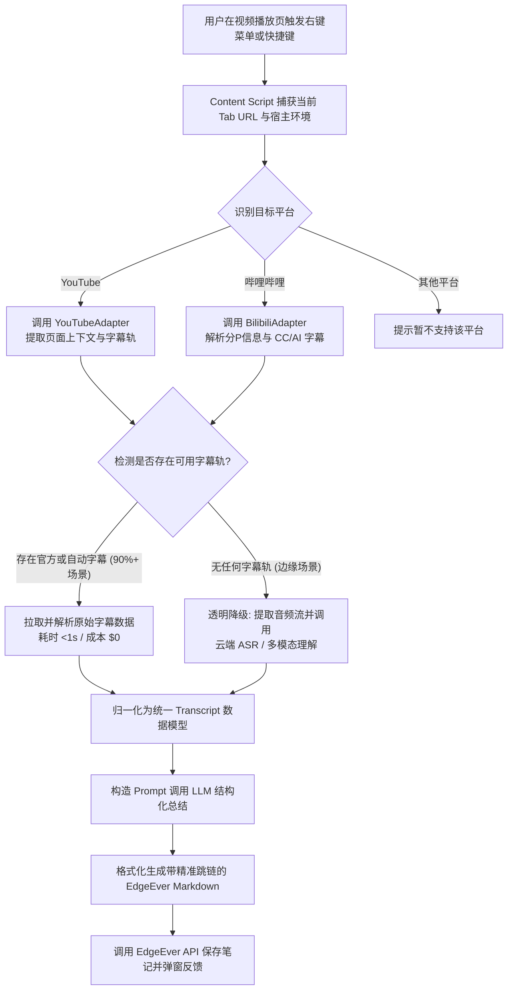

# EdgeEver 浏览器插件：视频内容抓取、字幕识别、AI 归纳与转存笔记技术方案（YouTube & 哔哩哔哩）

本文档梳理 EdgeEver 浏览器扩展（Chrome / Firefox / Edge 等）支持**网络视频内容智能提取、AI 总结归纳并一键转存笔记**的产品设计与技术实现方案。初期重点适配 **YouTube** 与 **哔哩哔哩（Bilibili）** 两大主流长视频平台，整体架构设计采用插件化适配器模式（Adapter Pattern），以便未来平滑扩展更多音视频平台。


---

## 1. 核心目标与用户场景

### 1.1 核心目标
* **一键总结转存**：用户在 YouTube 或哔哩哔哩视频播放页浏览时，可通过**右键上下文菜单**或**插件弹窗快捷键**，一键对当前视频（或选定分 P）进行智能提炼并保存笔记。
* **精准元数据提取**：自动捕获视频标题、UP主/频道名称、分P信息、封面、视频时长与规范化源链接。
* **智能结构化提炼**：由 AI 归纳生成**一句话结论（TL;DR）、带精确跳转时间戳的分段重点大纲、核心知识点清单与思维框架**。
* **精准回溯播放**：大纲中的所有时间戳均渲染为可点击跳转链接，点击即可直接定位到原视频对应秒数播放。
* **高性价比与秒级响应**：优先直接获取官方人工字幕与平台自动生成字幕（耗时 `<1s`，成本 `$0`）；对于无字幕冷门视频，提供透明降级的语音识别（ASR）转录机制。
* **可扩展架构**：核心业务抽象为统一接口，初期适配 YouTube 与 Bilibili，未来低成本接入 Vimeo、播客、小红书视频等更多平台。

### 1.2 平台范围与阶段规划
* **初期适配**：
  1. **YouTube**：全球最大的视频分享平台，覆盖中英文为主的科技、教程、演讲等内容。
  2. **哔哩哔哩（Bilibili）**：国内泛知识、学术公开课、技能教程与长视频核心社区。
* **未来扩展**：Vimeo、播客平台（Apple Podcasts / 小宇宙 Web 版）、Twitter/X 视频、小红书视频等。

---

## 2. 整体架构与分级处理流程

核心设计哲学：**“免费原生字幕优先（毫秒级 / 零成本），无字幕透明降级转录”**。



---

## 3. 双平台字幕与元数据提取策略详解

在浏览器扩展环境下，Content Script 运行于用户当前激活标签页的会话中，享有与页面完全一致的登录态与网络上下文，可直接读取页面变量或以合法会话发起内部 API 查询，免去服务端爬虫的反爬与风控限制。

### 3.1 YouTube 提取策略

#### 1. 目标 URL 匹配与标识符解析
* 视频播放页：`https://www.youtube.com/watch?v={videoId}`
* 网页短链：`https://youtu.be/{videoId}`
* Shorts 视频：`https://www.youtube.com/shorts/{videoId}`
* 时间戳跳转链接规则：`https://youtu.be/{videoId}?t={seconds}`

#### 2. 元数据与字幕抓取机制
1. **页面上下文解析**：直接从播放器全局变量 `window.ytInitialPlayerResponse` 中提取：
   * 视频元数据：`videoDetails`（标题、频道名称 `author`、时长 `lengthSeconds`、缩略图 `thumbnail`）。
   * 字幕轨道列表：`captions.playerCaptionsTracklistRenderer.captionTracks`。
2. **字幕轨道语言选择策略**：
   * 优先匹配用户界面语言偏好（如中文 `zh-Hans` / `zh-CN`、英文 `en`）。
   * 若无完全匹配语言，优先选择人工上传字幕轨（`kind` 不为 `'asr'`）；次选官方 ASR 自动转写轨。
3. **数据格式转换**：
   * 请求字幕轨的 `baseUrl`（增加 `&fmt=json3` 获取结构化 JSON 或解析默认 XML）。
   * 将分段中的 `tStartMs` 与 `dDurationMs` 转换为标准秒级浮点数，合并文本片段得到连贯词句。

---

### 3.2 哔哩哔哩（Bilibili）提取策略

#### 1. 目标 URL 匹配与分 P 标识解析
* 标准视频页：`https://www.bilibili.com/video/{bvid}` 或 `https://www.bilibili.com/video/av{aid}`
* 分 P 视频：URL 包含 `?p={partIndex}` 参数（如 `?p=2` 代表第 2 集/分P）。
* 时间戳跳转链接规则：`https://www.bilibili.com/video/{bvid}/?p={partIndex}&t={seconds}`（若为单 P 则可省略 `p`）。

#### 2. 分 P 识别与上下文解析
Bilibili 的长教程与公开课普遍采用**多 P（Multi-part）**形式，每一 P 拥有独立的 `cid`，且对应不同的字幕轨道与时长。
1. **获取视频整体信息**：
   * 从页面变量 `window.__INITIAL_STATE__` 中直接读取 `videoData`：
     * `bvid`、`aid`、主标题 `title`、封面 `pic`、UP主 `owner.name` 与 `owner.mid`。
     * 分 P 列表 `pages`：包含各分 P 的 `cid`、`page`、`part`（分P子标题）、`duration`。
2. **确定当前播放分 P**：
   * 解析当前 URL 的 `?p=` 参数；若无参数，则匹配页面 DOM 高亮项（如 `.cur-list .on`）或默认为 `p=1`。
   * 取出当前分 P 对应的 `cid` 与分 P 子标题。

#### 3. 字幕数据获取机制
Bilibili 页面已支持官方 CC 字幕和 AI 自动生成字幕（如 `lan: "ai-zh"`、`lan_doc: "中文（自动生成）"`）。
1. **字幕轨道查询**：
   * 方式 A（页面预加载）：直接从 `__INITIAL_STATE__.videoData.subtitle` 读取已注入的字幕列表。
   * 方式 B（内部 Player 接口）：向 `https://api.bilibili.com/x/player/v2?cid={cid}&bvid={bvid}` 发起 GET 请求（带当前 Tab Cookie），从响应的 `subtitle.subtitles` 获取字幕轨道清单。
2. **字幕轨偏好选择**：
   * 优先选择人工审核的 CC 轨（`is_machine === 0`）；
   * 次选平台自动生成的 AI 轨（`is_machine === 1`，通常为 `ai-zh`）。
3. **Bilibili 字幕 JSON 解析**：
   * 请求 `subtitle_url`（如 `//aisubtitle.hdslb.com/...`，注意补全 `https:` 协议前缀）。
   * 结构为标准的 JSON 对象：
     ```json
     {
       "body": [
         { "from": 0.0, "to": 3.25, "content": "各位小伙伴大家好，本节课我们讲解..." },
         { "from": 3.5, "to": 7.18, "content": "如何使用 TypeScript 构建可扩展应用架构。" }
       ]
     }
     ```
   * 直接提取 `from`（秒）、`to`（秒）与 `content`，与统一模型无缝契合。

---

## 4. 无字幕视频的透明降级转录机制

对于部分既没有人工 CC 字幕、平台也未自动生成字幕的视频，采取三级降级策略：

| 方案 | 技术实现 | 优势 | 成本与体验权衡 | 适用场景 |
| :--- | :--- | :--- | :--- | :--- |
| **首选：平台原生字幕** | 读取 YouTube / Bilibili 官方字幕数据 | 毫秒级提取、零服务器成本、高准确率 | 无 | 主流场景（90%+ 视频） |
| **二级降级：高性价比云端 ASR** | 提取低码率音频切片，调用 Groq Whisper API 或 Cloudflare Workers AI | 转录速度快（30~50x 实时速），精度达到 Whisper Large 水准 | 成本极低（约 $0.03/小时），需服务端转发音频切片 | 官方无字幕时的首选降级 |
| **三级降级：Gemini 多模态一步提炼** | 将音频分片/URI 直传 Gemini 1.5/2.0 原生音视频理解接口 | 免去单独 ASR 与文字拼接，直接输出带时间戳大纲与总结 | 输入 Token 按多模态计费，对长视频网络上行要求高 | 适合短视频或重点片段深研 |

### 用户端反馈交互体验
* **原生字幕就绪**：插件弹窗/通知显示：“检测到平台字幕，正在生成 AI 结构化总结…”（1~3 秒完成）。
* **触发无字幕 ASR**：插件显示：“当前视频暂无可用字幕，正在转录音频（约需 10~20 秒）…”，完成后自动保存并提示。

---

## 5. 归一化数据模型与适配器接口设计

为保证多平台扩展时不改动核心 Pipeline 与 LLM 逻辑，设计清晰的统一接口抽象：

### 5.1 数据模型规范

```typescript
// 归一化字幕片段
export interface TranscriptSegment {
  start: number; // 开始时间（秒，浮点数）
  end: number;   // 结束时间（秒，浮点数）
  text: string;  // 文本内容
}

// 归一化视频元数据
export interface VideoMetadata {
  platform: "youtube" | "bilibili" | string;
  videoId: string;             // YouTube Video ID 或 Bilibili BV 号
  partIndex?: number;          // 分 P 序号（如 1, 2）
  partTitle?: string;          // 分 P 标题（如 "P2: 核心配置与架构设计"）
  title: string;               // 视频主标题
  author: string;              // 频道名或 UP 主昵称
  authorUrl?: string;          // 创作者主页链接
  duration: number;            // 视频时长（秒）
  thumbnailUrl: string;        // 封面图链接
  sourceUrl: string;           // 规范化源视频播放链接
  hasSubtitles: boolean;       // 是否成功取得原生字幕
  subtitleType?: "creator" | "platform_ai" | "asr_fallback";
}
```

### 5.2 适配器接口抽象（`VideoPlatformAdapter`）

```typescript
export interface VideoPlatformAdapter {
  readonly platform: string;

  /** 判断当前 Tab URL 是否属于该平台 */
  canHandle(url: URL): boolean;

  /** 从页面上下文中提取视频元数据与分 P 信息 */
  extractMetadata(document: Document, windowContext: unknown): Promise<VideoMetadata>;

  /** 获取归一化字幕片段；若无字幕返回 null */
  extractTranscript(metadata: VideoMetadata, windowContext: unknown): Promise<TranscriptSegment[] | null>;

  /** 将时间（秒）格式化为平台原生支持的时间戳跳转 URL */
  formatTimestampUrl(metadata: VideoMetadata, seconds: number): string;
}
```

任何未来新增的平台（如 `VimeoAdapter`、`XiaohongshuVideoAdapter` 等），仅需实现上述 4 个方法，即可接入完整的 EdgeEver 剪藏与总结流程。

---

## 6. AI 总结 Prompt 结构与笔记渲染规范

### 6.1 Prompt 设计规范
* **角色设定**：专业视频内容分析师与知识提炼专家。
* **输入内容**：
  * 视频元信息：平台名称、标题、作者、分 P 信息、时长。
  * 合并整理后的时间戳字幕段落（将短句按 30~60 秒合并为语意块，减少 Token 浪费）。
* **输出规范**：
  1. **一句话核心总结 (TL;DR)**：提炼全篇核心价值与核心论点。
  2. **分段重点大纲 (Key Highlights)**：
     * 关键节点必须附带格式为 `[mm:ss](跳转链接)` 的跳转标记。
     * 阐述该时间段的核心内容、演示过程或核心论证。
  3. **核心知识点与干货清单 (Takeaways)**：
     * 提炼专业概念、关键参数、技术选型或实践建议。
  4. **完整字幕实录折叠区 (Transcript)**：以 `<details>` 标签包裹，便于全文检索。

### 6.2 目标 EdgeEver Markdown 笔记形态

```markdown
# 打造第二大脑：从零构建个人知识库系统

> **来源**：[影视飓风 - 打造第二大脑：从零构建个人知识库系统](https://www.bilibili.com/video/BV1xx411c7xx?p=1)  
> **平台**：哔哩哔哩 (P1: 知识库的核心逻辑) | **时长**：24:15  
> **字幕来源**：平台 AI 字幕 | **保存时间**：2026-10-05  


---

## 💡 核心总结 (TL;DR)
视频系统性梳理了知识管理的核心困境，提出了“输入-整理-输出”闭环流，并演示了如何基于标签网络与双链系统构建抗遗忘的第二大脑。

## 📌 分段大纲与精彩看点
- [00:00](https://www.bilibili.com/video/BV1xx411c7xx?p=1&t=0) 导语：为什么传统文件夹分类注定失效
- [04:12](https://www.bilibili.com/video/BV1xx411c7xx?p=1&t=252) 核心模型拆解：PARA 框架与渐进式总结法的融合
- [11:35](https://www.bilibili.com/video/BV1xx411c7xx?p=1&t=695) 现场演示：从碎片收集到结构化笔记的转化全流程
- [18:50](https://www.bilibili.com/video/BV1xx411c7xx?p=1&t=1130) 工具选择哲学：避免陷入“工具挑选强迫症”
- [22:30](https://www.bilibili.com/video/BV1xx411c7xx?p=1&t=1350) 总结与实践行动建议

## 🔑 核心知识点与干货清单
- **知识折旧率**：未经主动加工的收藏内容，其复用价值随时间指数级衰减。
- **渐进式总结法（Progressive Summarization）**：
  1. 第一层：原始实录抓取；
  2. 第二层：加粗关键短语；
  3. 第三层：提炼摘要总结；
  4. 第四层：转化为个人项目行动。

<details>
<summary><b>点击展开完整字幕实录 (Transcript)</b></summary>

[00:00] 大家好，我是 Tim。今天我们来聊一聊知识管理...  
[00:25] 很多人在收藏了一堆文章和视频之后，就再也没有打开过...  
...
</details>
```

---

## 7. 浏览器插件模块划分与工程落地

与 EdgeEver 现有剪藏体系（`tweet-clip.ts`、`zhihu-clip.ts`、`xhs-clip.ts`）保持高度一致的模块结构：

```
apps/extension/src/
├── video/
│   ├── types.ts                 # VideoMetadata, TranscriptSegment, VideoPlatformAdapter 接口
│   ├── transcript-helper.ts     # 时间戳合并、文本清理、格式转换通用工具
│   ├── adapters/
│   │   ├── youtube.ts           # YouTubeAdapter：URL 判定、ytInitialPlayerResponse 解析
│   │   └── bilibili.ts          # BilibiliAdapter：URL 判定、分P识别、CC/AI 字幕解析
│   ├── video-clip.ts            # 调度适配器、执行提取与降级回退
│   └── video-summary.ts         # Prompt 组装、调用 LLM、排版 Markdown
├── capture-video.ts             # 注入到当前标签页执行的 Content Script 抓取器
├── video-target.ts              # 监听右键菜单目标，记录当前激活的目标视频与分 P
└── background.ts                # 注册 contextMenus ("保存视频总结")，调度完整保存流
```

---

## 8. 实施推进计划

1. **第一阶段：多平台原生字幕与 AI 总结闭环（MVP）**
   * 完成 `VideoPlatformAdapter` 抽象及 `youtube.ts`、`bilibili.ts` 适配器。
   * 支持 YouTube（多语言+ASR字幕）与 Bilibili（分P识别+CC/AI字幕）的零成本极速提取。
   * 打通 LLM 结构化总结并写入 EdgeEver 笔记库。
2. **第二阶段：无字幕 ASR 降级通道**
   * 集成轻量音频提取与云端 ASR（Groq Whisper / Cloudflare Workers AI）降级通道。
   * 优化长视频分块并发处理与进度提示。
3. **第三阶段：体验增强与平台拓展**
   * 支持多模板切换（如“精简摘要”、“教程笔记模版”、“播客对话模版”）。
   * 接入更多音视频平台（Vimeo、小宇宙播客、Twitter/X 视频）。
